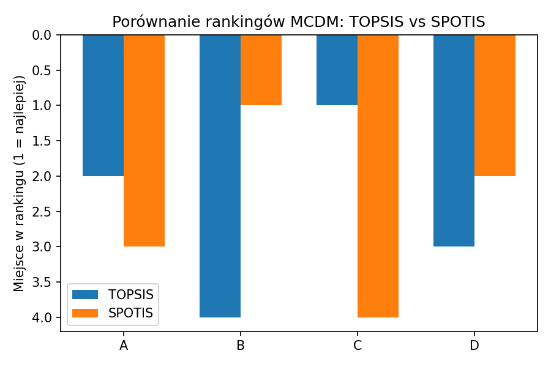

---

## 4. Rankingi decyzyjne

| Alternatywa | TOPSIS | SPOTIS |
|-------------|:------:|:------:|
| **A**       |   2    |   3    |
| **B**       |   4    |   1    |
| **C**       |   1    |   4    |
| **D**       |   3    |   2    |

Ranking TOPSIS: [2 4 1 3]  
Ranking SPOTIS: [3 1 4 2]

---

## 5. Wizualizacja wyników

---

## 6. Wnioski

- Wyniki TOPSIS i SPOTIS różnią się – metody oceniają alternatywy na podstawie innych algorytmów.
- Równe wagi pozwalają porównać czysto mechanicznie, ale w praktyce warto dobrać je ekspercko lub automatycznie (gdy entropy działa).
- Przy większych różnicach rankingów warto przeanalizować czułość i wpływ wag, a wyniki dobrze wizualizować.

---

## 7. Pliki projektu

- `mcdm_analysis.py` – kod analizy
- `figures/ranking_compare.png` – wykres
- `report.md` – to sprawozdanie

---
